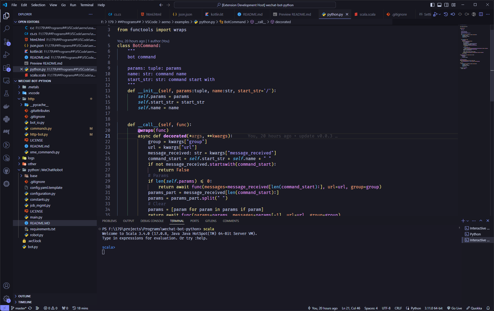

    

     
    
A Simple theme for Visual Studio Code 

    
     

## Themes

-   Aerno Dark

More themes(light, dimmed ...) are coming soon...

    
Preview

### Code

### Setting

## Installation

1. Search Extensions "Aerno" in Visual Studio Code
2. Install then press `ctrl + k`, `ctrl + t` to select color theme

## Other / License

### [Change Log](CHANGELOG.md)

### [MIT License (c) 2024 xzadudu179](https://github.com/xzadudu179/Aerno-Theme/blob/master/LICENSE)